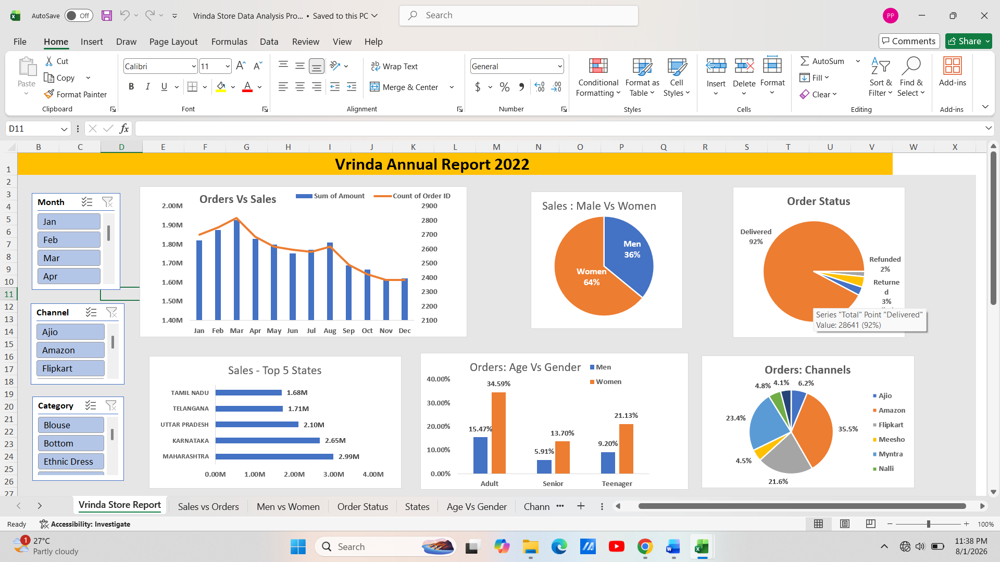

# 📊 Vrinda Store Data Analysis Dashboard (Excel)

## 📌 Project Overview
This project presents an interactive Excel dashboard built using the Vrinda Store sales dataset for the year 2022. The dashboard analyzes sales performance, customer behavior, order status, sales channels, and regional performance to generate meaningful business insights.

## 🎯 Project Objective
The objective of this project is to:
- Analyze annual sales performance.
- Identify customer purchasing patterns.
- Compare sales across different channels.
- Understand order status distribution.
- Identify top-performing states.
- Build an interactive dashboard for business decision-making.

## 🛠️ Tools & Technologies
- Microsoft Excel
- Pivot Tables
- Pivot Charts
- Slicers
- Data Cleaning
- Data Visualization

## 📊 Dashboard Features
- 📈 Monthly Orders vs Sales Analysis
- 👩‍🦰 Men vs Women Sales Distribution
- 📦 Order Status Analysis
- 🏆 Top 5 States by Sales
- 👥 Age Group vs Gender Analysis
- 🛒 Sales by Sales Channel
- 🎛 Interactive Filters (Month, Channel, Category)

## 📷 Dashboard Preview

---

## 📌 Key Insights
- Women contributed **64%** of total sales.
- **92%** of orders were successfully delivered.
- Maharashtra recorded the highest sales.
- Amazon generated the largest share of orders.
- Adult women were the most valuable customer segment.
- Sales were highest during the first quarter of the year.

## 💼 Business Recommendations
- Focus marketing campaigns on women customers.
- Increase investment in high-performing sales channels like Amazon.
- Improve logistics to reduce returns and refunds.
- Offer promotions during low-sales months.
- Expand marketing efforts in top-performing states.

## 📂 Repository Structure
- README.md
- Project Description
- dashboaed.png
- Vrinda_Store_Data.xlsx
- Vrinda_Sales_Dashboard.xlsx

## 🚀 Skills Demonstrated
- Data Cleaning
- Data Analysis
- Dashboard Design
- Excel Pivot Tables
- Data Visualization
- Business Analytics
- Reporting

## 👩‍💻 Author
**Pranjali Ugale**

⭐ If you found this project helpful, please give it a ⭐ on GitHub.
